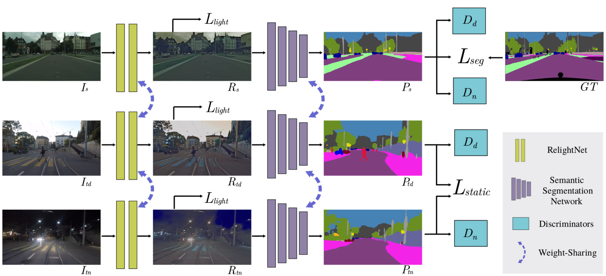
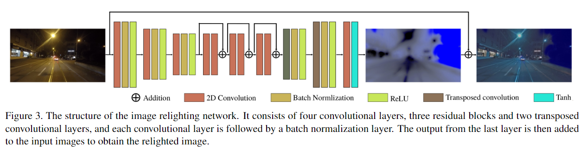

# Method

## Previous
 require an additional pre-processing stage of training an image transfer model between daytime and nighttime
## DANNet
* Adapt the model from Cityscapes, which contains large-scale training data with labels, to Dark Zurich-D
* The prediction of Dark Zurich-D is used as a pseudo supervision for Dark Zurich-N in the network training
* image relighting subnetwork & adversarial learning 
## Architecture
### Image relighting network 

make the intensity distributions
of the images from different domains to be close such that
the later semantic segmentation network is less sensitive
to illumination changes
### Semantic segmentation network
Deeplab-v2 , RefineNet and PSPNet . 
### Discriminators
distinguish whether the segmentation predic-
tion comes from the source domain or either of the target
domains 
## Probability re-weighting
the numbers of pixels for different object categories are imbalanced
  